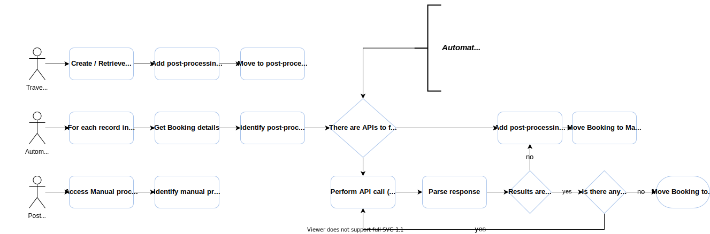

# Automation Solutions Postman collection

This Postman collection was created to showcase Sabre APIs and provide developers the ability to test them freely.

# Process outline

The collection depicts common scenarios to automate your post-booking processes. 

Using Postman scripting capabilities, we've created a simple workflow to illustrate how to implement automation :

# APIs used on this collection

| API | Description | Documentation |
|-----|-------------|---------------|
| Create Booking | Create Booking provides a single, unified service to create a booking for different content sources (NDC, ATPCO, LCC, CSL hotels, cars, and legacy GDS hotels). This is achieved by executing internal calls to the PNR, Order, Pricing, Hotel, and Car domains respectively. The newly created Order and/or Sabre Passenger Name Record (PNR) information is then consolidated into a single normalized response | [Booking Management APIs](https://developer.sabre.com/docs/rest_apis/trip/orders/booking_management) |
| InstaFlights Search | The InstaFlights Search API retrieves roundtrip or one-way flight itineraries with published fares and fare breakdowns for a given city pair and departure date. | [Inspirational Search and Intelligence APIs](https://developer.sabre.com/inspirational-search-and-intelligence-apis) |
| Access Queue | The Access Queue (QueueAccessLLSRQ) API is used to access a designated queue or to navigate within the particular queue. | [QueueAccessLLSRQ](https://developer.sabre.com/docs/soap_apis/management/queue/Access_Queue) |
| Get Booking | Get Booking provides a normalized view of reservations by combining both PNRs and orders. | [Booking Managment APIs](https://developer.sabre.com/docs/rest_apis/trip/orders/booking_management) |
| Issue Tickets | The Enhanced Air Ticket API is used to issue one or multiple air tickets and/or EMDs (Electronic Miscellaneous Documents) within a single API call. | [Enhanced Air Ticket](https://developer.sabre.com/docs/rest_apis/air/fulfill/enhanced_air_ticket) |
| Void Flight Tickets | Void Flight Tickets provides a single, unified service to void a list of electronic documents (ATPCO). This includes electronic tickets and electronic miscellaneous documents (EMD). | [Booking Management APIs](https://developer.sabre.com/docs/rest_apis/trip/orders/booking_management)  |
| Cancel Booking | Cancel Booking provides a single, unified service to cancel the entire reservation, or a part of the reservation, irrespective of what it contains (flight, hotel, car, others) and where it is created (NDC, Sabre, CSL). This includes an option to void or refund corresponding electronic documents for flights (ATPCO & NDC). | [Booking Management APIs](https://developer.sabre.com/docs/rest_apis/trip/orders/booking_management) |

For more information abut Sabre APIs suitable for Automation Solutions take a look at the [Product Collection on Sabre DevStudio](https://developer.sabre.com/automation-solutions)

# Scripts and Variables

This collection deeply utilizes Postman scripting capabilities which let you parse an API call result, and store values into variable so it can be used on subsequent calls. Also, Postman allows you to programatically chain requests according to logic defined by the developer.

Collection level scripts
  - Fill in authentication token depending on the API request type (REST or SOAP)
  - Parse response for Transport and Service errors

Individual Request scripts
  - Pre fill variables to be used on the request body
  - Parse results and store values onto variables for subsequent usage
  - Control request flow by using of SetNextRequest()

# Postman Runner

This collection is suitable for usage of Runners, which will allow you to simulate the queue automation scenario depicted above. There are 3 main workflows that could be executed "automatically" : 
- Create Sample booking and move to post booking queue
- Iterate over post booking queue and issue tickets where applicable, move to post ticketing queue or manual processing queue where applicable
- Iterate over post ticketing queue and void ticket and cancel booking where applicable.

### Installing

Here are one-time steps for getting your test environment set up:

* Run the Postman app on your local development machine 
* Import the [environment file](https://github.com/SabreDevStudio/postman-collections/blob/master/Sabre-APIs/Sabre_APIs_CERT.postman_environment.json) into Postman using the File -> Import option
* Import the Postman Collection file (link below) into Postman using the File -> Import option

| Collection version | Comments |
| - | - | 
| [current](./Sabre-Automation-Solutions.postman_collection.json) | Automation Solutions Postman collection, first release | 

### Use Your Credentials

The environment file you imported has a list of key/value pairs that you need to update with your REST API credentials. The following variables have been marked out with dummy values:
 
  * `username` - also known as EPR (employee profile record)    
  * `password` - your Sabre provisioned password
  * `pcc` - also known as pseudo city code (your agency's unique identifier)

Update the dummy values with your official credentials. To do that follow these steps:

  * Click the gear icon to go to the manage environments pop-up dialog box.
  * Click on the name of your imported environment file to see a list of all key/value pairs.
  * Enter your credentials, and press the "Update" button.    

## License

Copyright (c) 2021 Sabre Corp Licensed under the MIT license.

## Disclaimer of Warranty and Limitation of Liability

This software and any compiled programs created using this software are furnished “as is” without warranty of any kind, including but not limited to the implied warranties of merchantability and fitness for a particular purpose. No oral or written information or advice given by Sabre, its agents or employees shall create a warranty or in any way increase the scope of this warranty, and you may not rely on any such information or advice.
Sabre does not warrant, guarantee, or make any representations regarding the use, or the results of the use, of this software, compiled programs created using this software, or written materials in terms of correctness, accuracy, reliability, currentness, or otherwise. The entire risk as to the results and performance of this software and any compiled applications created using this software is assumed by you. Neither Sabre nor anyone else who has been involved in the creation, production or delivery of this software shall be liable for any direct, indirect, consequential, or incidental damages (including damages for loss of business profits, business interruption, loss of business information, and the like) arising out of the use of or inability to use such product even if Sabre has been advised of the possibility of such damages.
