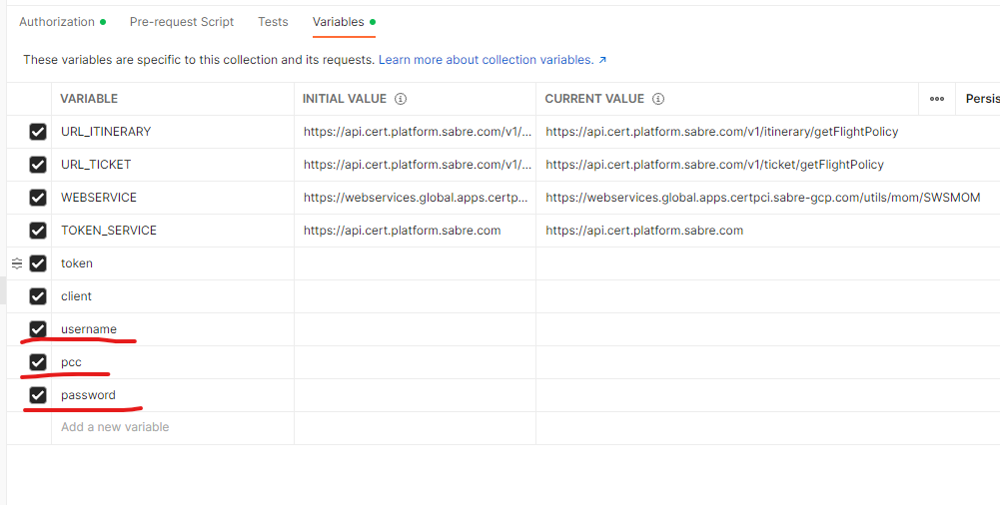

# Flight Policy Display API Postman files

Sabre's Flight Policy Display API provides flight policy information including cancellation, change, and refund policies for specific flights and fare products.

This Postman collection was created to showcase Sabre APIs and provide developers the ability to test them freely.

## Getting Started

### Prerequisites

* [Postman](https://www.postman.com/) app
* [Sabre APIs CERT-environment credentials](https://developer.sabre.com/resources/getting_started_with_sabre_apis/)
* SIM Attributes - to be able to use the API, you need to have the following SIM attributes enabled on your Sabre account:
  * FlightPolicyDspUsrItin - allows you to use /v1/itinerary/getFlightPolicy endpoint
  * FlightPolicyDspUsrtkt - allows you to use /v1/ticket/getFlightPolicy endpoint

  To request the SIM attribute for web services EPR please contact Sabre account manager and for agent EPR please write to Sabre system support (system.support@sabre.com).

### Installing

* Run the Postman application on your local development machine
* Import the environment file into Postman using File -> Import
* Import the Flight Policy Display collection file into Postman using File -> Import

### Use Your Credentials

Collection contains a list of key/value pairs variables that you need to update with your API credentials:

* `username` - also known as EPR (employee profile record)
* `pcc` - also known as pseudo city code (your agency's unique identifier)
* `password` - your Sabre provisioned password

Update the values with your official credentials (make sure the 'current value' column is set).

## Running the Tests

1. Authenticate using one of the authentication requests in the Authentication folder (get ATK token/get ATH token) 
and make sure you receive a 200 Success result. (Authentication is valid for the token's time to live, so you don't need to authenticate before every request.)
2. Send a Flight Policy Display request and look for a 200 Success result

## License

Copyright (c) 2020 Sabre Corp Licensed under the MIT license.

## Disclaimer of Warranty and Limitation of Liability

This software and any compiled programs created using this software are furnished "as is" without warranty of any kind, including but not limited to the implied warranties of merchantability and fitness for a particular purpose. Sabre does not warrant, guarantee, or make any representations regarding the use, or the results of the use, of this software. Neither Sabre nor anyone else who has been involved in the creation, production or delivery of this software shall be liable for any direct, indirect, consequential, or incidental damages arising out of the use of or inability to use such product.