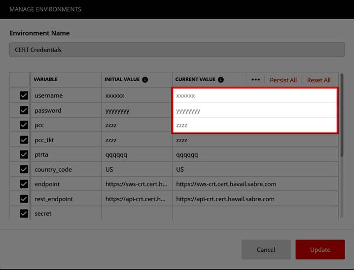

# Sabre APIs Postman Collection (v2019.09)

This Postman collection was created to showcase Sabre APIs and provide developers the ability to test* them freely.

*Sabre APIs Test credentials are required to successfully test these APIs, if you are an existing Sabre APIs customer and do not have your CERT credentials, please contact your Sabre account manager.

## Getting Started

These instructions will get you a copy of the project up and running on your local machine for development and testing purposes. See deployment for notes on how to deploy the project on a live system.

### Prerequisites

Things you need to install:

* [Postman](https://www.getpostman.com/) app

You'll also need your  [Sabre APIs CERT-environment credentials](https://developer.sabre.com/resources/getting_started_with_sabre_apis/)

### Installing

Here are one-time steps for getting your test environment set up:

* Run the Postman app on your local development machine 
* Import the [Sabre APIs v2019.09 environment file](./Sabre_APIs_v2019.09.postman_environment.json) into Postman using the File -> Import option
* Import the [Sabre APIs v2019.09 collection file](./Sabre_APIs_v2019.09.postman_collection.json) into Postman using the File -> Import option 

### Use Your Credentials

The environment file you imported has a list of key/value pairs that you need to update with your SOAP API credentials. The following variables have been marked out with dummy values:
 
  * `username` - also known as EPR (employee profile record)    
  * `password` - your Sabre provisioned password
  * `pcc` - also known as pseudo city code (your agency's unique identifier)

Update the dummy values with your official credentials. To do that follow these steps:

  * Click the gear icon to go to the manage environments pop-up dialog box.
  * Click on the name of your imported environment file to see a list of all key/value pairs.
  * Enter your credentials, and press the "Update" button.    

## Running the Tests

1. Authenticate. If you are unsure where to start, access the Authentication folder (the first on the list). This folder list the 3 available forms of authentication. Once you have provided the credentails into the postman environment variables you should be able to click ***Send*** any of those authentication options. Once you do, look for a 200 Success result. If it failed review your environment credentials.
2. At the bottom of the collection file you will find a series of folders flagged as "Workflows", these are a small sample of common workflows to get you started.
3. The rest of the collection contains a vast array of stand alone Sabre API calls, feel free to expolore on your own based on your business needs.
4. Once you have authenticated yourself feel free to explore and test our Sabre APIs on your own! 

For more information on Sabre APIs please access our Developer Portal [Sabre Dev Studio.](https://developer.sabre.com/) 

## License

Copyright (c) 2019 Sabre Corp Licensed under the MIT license.

## Disclaimer of Warranty and Limitation of Liability

This software and any compiled programs created using this software are furnished “as is” without warranty of any kind, including but not limited to the implied warranties of merchantability and fitness for a particular purpose. No oral or written information or advice given by Sabre, its agents or employees shall create a warranty or in any way increase the scope of this warranty, and you may not rely on any such information or advice.
Sabre does not warrant, guarantee, or make any representations regarding the use, or the results of the use, of this software, compiled programs created using this software, or written materials in terms of correctness, accuracy, reliability, currentness, or otherwise. The entire risk as to the results and performance of this software and any compiled applications created using this software is assumed by you. Neither Sabre nor anyone else who has been involved in the creation, production or delivery of this software shall be liable for any direct, indirect, consequential, or incidental damages (including damages for loss of business profits, business interruption, loss of business information, and the like) arising out of the use of or inability to use such product even if Sabre has been advised of the possibility of such damages.
